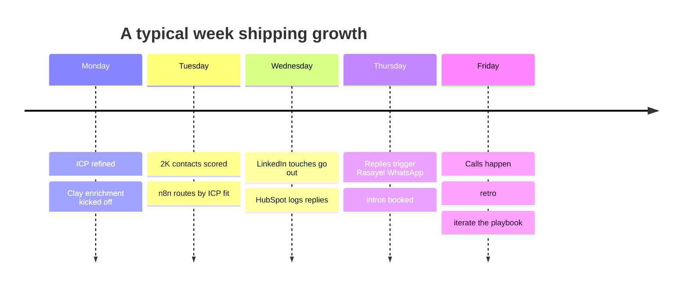
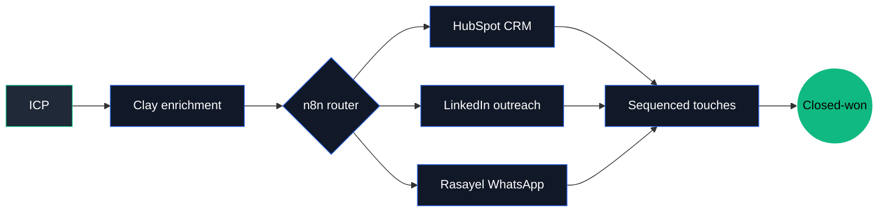

<!--
  github.com/lombazz — profile README
-->

<table>
<tr>
<td valign="top">
<pre>
,,,,,,,,,,,,,,,,,,,,,,,,,,,,,,,,,,,,
,,,,,,,,,,,,,,,,,,,,,,,,,,,,,,,,,,,,
;;;OKKKK000KKKKKKKKKKK0kOKKKKKKKKKKK
;;:NWWWWWWWWWWWWWWWWWWWWWWWWWWWWWMWW
;;:NWWWWWWWWWWWWNXXWWWWWWWWWWWWWWWWW
;;:NWWWWWW0xlOxll;;:ddOKNWWWWWWWWWWW
;;:NWWWWkcc;cc:..;',l:;,cxNWWWWWWWWW
::;l0XKkc''..;,''.'..';;lccOXXXXXXXX
:::cNXd,....  ....   ......oWWWWWWWW
:::cNXl'...  . ..   ..    .lNWWWWWWW
:::cNNc..  .  ,dd:....     .:0WWWWWW
ccccNWk:..::,':ok;'c;,;'. .oWWWWWWWW
ccc:KWNXlckkkkkkOl,oxxo;,.,OWWNNNNNN
ccccXWWNXxxkOOOdl,.,do;';:xNWWWWWWNN
ccclKWWWNXKxkkxddl:,;c'.oWWWWWWNNXXX
cccl0NNNNXKOddxxdllll;..oXXKKKKK0000
cccckXXXXK00Kddxxdo:'...lXKKKKKKKKKK
ccccd0OOOOOkdxl;..   ...c00OckOkOkkk
cc::loool,...;ool:''.''.,ol, ..':ood
cc:ckxo,.      .,::;,'..      ...';o
</pre>
</td>
<td valign="top">
<pre>
ale@gtm ──────────────────────────────

. Name: ................... Alessandro
. Surname: ................ Lombardo
. Role: ................... GTM Engineer
. Currently: .............. Building the GTM stack at Augment
. Random facts: ........... 21, Italian, and a Muay Thai fighter
</pre>
</td>
</tr>
</table>

[](https://www.linkedin.com/in/alessandro-lombardo-/)
[](https://x.com/lombazzzz)
[](https://github.com/lombazz)


### `~ by the numbers`

```
pipelines deployed     ░░░░░░░░░░  12
automations shipped    ░░░░░░░░░░  30+
leads enriched / month ░░░░░░░░░░  8K
tools in stack         ░░░░░░░░░░  15+
languages spoken       ░░░░░░░░░░  IT · FR · EN · JSON
muay thai sessions/wk  ░░░░░░░░░░   4
```


### `~ a week in my head`




### `~ the pipeline I run`




### `~ stack`


<sub>From Italy, with caffeine and impatience. Currently shipping from Paris.</sub>
