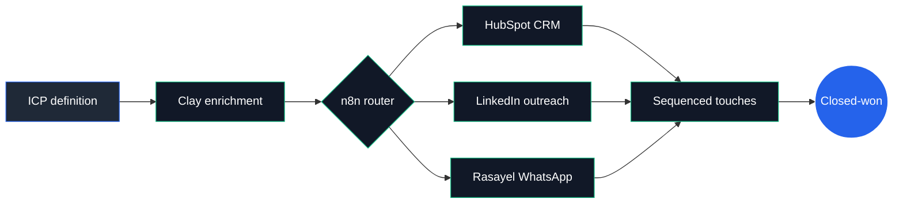
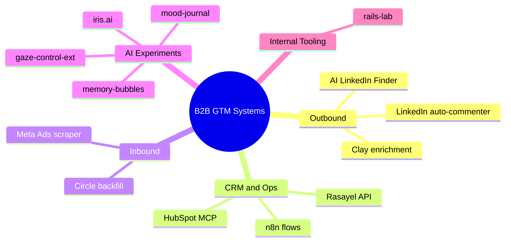

<!--
  Profile README for github.com/lombazz
  Renders as the landing card on Ale's GitHub profile.
-->

## About Me

```yaml
name: Alessandro Lombardo
location: Paris, France 🇫🇷 (Italian 🇮🇹)
role: GTM Engineer @ Augment
focus: B2B Growth · Sales Automation · AI Workflows
stack: HubSpot · n8n · Clay · Rasayel · Playwright · MCPs
automations_shipped: 30+
superpower: Going from messy spreadsheet → revenue-generating pipeline in 48h
also: Muay Thai fighter 🥊
```

[](https://www.linkedin.com/in/alessandro-lombardo-/)
[](https://x.com/lombazzzz)
[](https://augment.org)
[](https://github.com/lombazz)

---

## How I Ship Growth

The actual pipeline I build and operate. Tools change, the shape doesn't.



---

## Domains I Build In



---

## Stack

What I actually ship with — tools, not just languages.


---

## Selected Public Work

| Repo | What it does |
| --- | --- |
| **[gaze-control-ext](https://github.com/lombazz/gaze-control-ext)** | Chrome extension that lets you control your browser with eye gaze + hand gestures (MediaPipe). |
| **[ai-linkedin-finder](https://github.com/lombazz/ai-linkedin-finder)** | LLM-driven prospect discovery — describe an ICP in plain English, get a qualified list. |

> Most of my real work lives in private repos (HubSpot MCP, Meta Ads scraper, Rasayel ops, growth experiments) and in n8n workflows that don't have GitHub stars but ship revenue. Happy to walk through any of it on a call.

---

<sub>Built in Paris with ☕ and Italian impatience.</sub>
