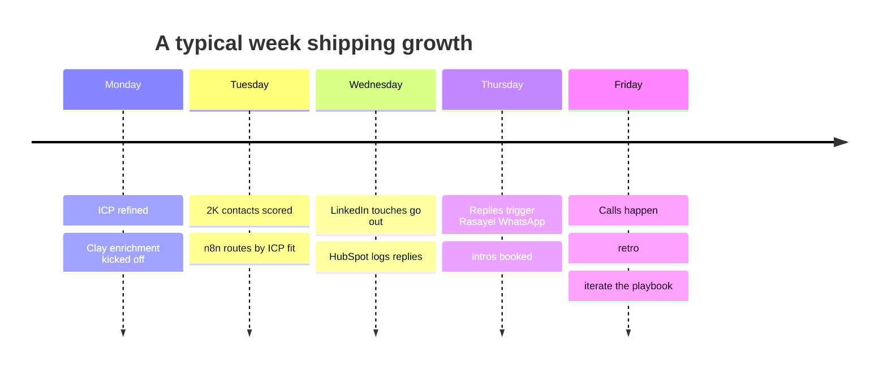
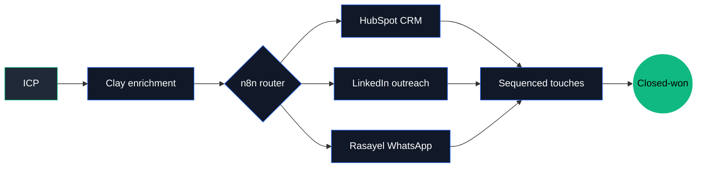

<!--
  github.com/lombazz — profile README
-->

```
,,,,,,,,,,,,,,,,,,,,,,,,,,,,,,,,,,,,,,,,,,,,,,,,,,,,,,,,,,,,,,,,,,,,,,''
,,,,,,,,,,,,,,,,,,,,,,,,,,,,,,,,,,,,,,,,,,,,,,,,,,,,,,,,,,,,,,,,,,,,,,,,
,,,,,,,,,,,,,,,,,,,,,,,,,,,,,,,,,,,,,,,,,,,,,,,,,,,,,,,,,,,,,,,,,,,,,,,,
;;;;,''',,,,,,,,,''',,,,,,'',,,,,,,'''',''''''...''''''''',,,,,,,,,,''''
;;;;,;xKXXXXXXXXXXXXXXXXXXXXXXXXXXXXXXXXXXXXXK0kOKXXXXXXXXXXXXXXXXXXXXXX
;;;;,lXWWWWWWWWWWWWWWWWWWWWWWWWWWWWWWWWWWWWWWWWNWWWWWWWWWWWWWWWWWWWWWWWW
;;;;,cXWWWWWWWWWWWWWWWWWWWWWWWWWWWWWWWWWWWWWWWWNWWWWWWMWMWWWWWWMMWWWWWWW
;;;;;cXWWWWWWWWWWWWWWWWWWWWWWWWWWWWWWWWWWWWWWWWNWWWWWWWWWWWWWWWWWWMWWWWW
;;;;;cXWWWWWWWWWWWWWWWWWWWWWWWWWWWWWWWWWWWWWWWWNWWWMWWWWWWWWWWWWWWWWWWWW
;;;;;cXWWWWWWWWWWWWWWWWWWWWWWWWNKKKKOKWWWWWWWWWNWWWWWWWWWWWWWWWWWWWWWWWW
;;;;;cKWWWWWWWWWWWWWWWNXOOXNNKdodolcccoxkOO0XWWNWWWWWWWWWWWWWWWWWWWWWWWW
;;;;;cKWWWWWWWWWWWNNKoc,''ddl;:cc:'','.':olccxOOKNWWWWWWWWWWWWWWWWWWWWWW
;;;;;cXWWWWWWWWWWdldol:cdc;::;''',::'';;cc.''.';lkOXWWWWWWWWWWWWWWWWWWWW
;;;;;cXWWWWWWWWWNc,;c;',:c:ol;'...,;,,,:ododc,;'':llXWWWWWWWWWWWWWWWWWWW
;;:;;:xKXXXXXXX0oc'.,,.'',lol:'....,,'...,:dddl;:lollOKXXXXXXXXXXXXXXXXX
:::::;,;x0KKK0kdl:;,'.....',,'',:;..;..... ...,:loc;,cxOKXXXXXXXXXXXXXXX
::::::;lXWWWKdl,'...';;.    ..'.,....  ....'. ..;,...;d0WWWWWWWWWWWWWWWW
::::::;lXWWOOl'....,....   .. .....       ............;0NWWWWWWWWWWWWWWW
::::::;lXWWxx..',,,'..    ..  .......      ..       ...dWWWWWWWWWWWWWWWW
::::::;lXWWKx....'..   .   .  ... .     .. .        ..cdNWWWWWWWWWWWWWWW
::::::;lXWWNOcc...      ..   ':o:,..........        ..;cxkOWWWWWWWWWWWWW
::::::;lXWWWO'.. .    .    .;oxxkxdl;..  ..            ...oWWWWWWWWWWWWW
cc::c:;lXWWK'...   ...'.......:oxdc'..........         ,xOXWWWWWWWWWWWWW
ccccc:;lXWWWOl'.   .:;;,,'..,;ldOkc..,:l,'..';,..     'NWWWWWWWWWWWWWWWW
cccccc;lXWWWWWX0c. ;xdolcc:codxkOkl',:oddooddoc;,. ..';WWWWWWWWWWWWWWWWW
cccccc:lKWWWWWWK;;::kOOOkkkOOkkkOkd;';ldxkxxdoc;;'...,oWWWWWWWWWWWWWWNNN
cccccc:;kXNNNXXK0Ox;xOOOOOOOOOkOO0Oo;';dxkxdoc;';'.',;dNNNNNNNNNNXXXXXXX
cccccc:lKWWWWNNNNKddkxkkOOOOOkkdloc....:dxdoc;'';'.';oNWWWWWWWWWWWWWWWWN
cccccccoKWWWWWWWNXxxxdxkkkOOOkxc;:.....,ldoc;'.':coxONWWWWWWWWWWNWWNNNWW
cccccccoOXNWWWWNNNKOkkxxkkOOkkkkkxooc:;;;:cc,'.';OWWWWWWWWWWWWWNNNNXNNNN
cccccccoONWWWWWWWNWWNNOdxxxxxllcllc:;,'.':lc'...'0WWWWWWWWWWNNNNXXXXKKKK
ccccccclOXNNNNNNNNNXXX0ddddddddolc::::;:cll,....'KNNNNNXXXXXXXXKK000O000
ccccccclkKXXXNNNNNXK00Kkodddxxxxxxxxxxxdol;'....'0KKK0000000000000000000
ccccccccxKXXXXNNWNX00000OxddxkkOOOkkkxdoc;'.....'0KKKKK0000KKKKK00KKKXXK
ccccccccd0KXXKXXXXK0000KXXxlodddddddol:,.........OXXKKKKKKKKKKKKKKKKKKKK
ccccccccd0KXKK00000000KXXX0dl;,,'''...      .....OXXXXXKK00KK0000KK00000
ccccclc:lkO0OOOOOOOOOOOxloxxdoc,..        .......x0K0O0d,;xO0OOOOOOkkkkk
cccccc:;,;ccccccccc::::..;;dddolc;,'.............:dkkdOx. .:::::::c:::::
ccccc;;ldoooddxdxxo,.    .;ldddoolc;'''''.''''...;okxl,   ....';cdkkxxxx
ccccc;;dOOOOOOxoc'.         .,:looolcc::;;;;,'......       ......';coxkO
ccccc;;okkxdc'..                 .',,,,''....               ......''.''c
```

### `Alessandro Lombardo` — GTM engineer, not a software one.

> I don't write apps. I engineer the path from cold lead to closed deal.
> **n8n is my IDE.** HubSpot is my prod database. Growth is the function.

🇮🇹 Italian · 📍 Paris · 🥊 Muay Thai · 💼 [Augment](https://augment.org)

[](https://www.linkedin.com/in/alessandro-lombardo-/)
[](https://x.com/lombazzzz)
[](https://github.com/lombazz)

---

### `~ by the numbers`

```
pipelines deployed     ░░░░░░░░░░  12
automations shipped    ░░░░░░░░░░  30+
leads enriched / month ░░░░░░░░░░  8K
tools in stack         ░░░░░░░░░░  15+
languages spoken       ░░░░░░░░░░  IT · FR · EN · JSON
muay thai sessions/wk  ░░░░░░░░░░   4
```

> *(numbers approximate, growth-engineer style — the point is the shape, not the precision)*

---

### `~ a week in my head`



---

### `~ the pipeline I run`



---

### `~ stack`


---

### `~ currently building`

- 🔧 **HubSpot ↔ n8n MCP layer** — letting LLMs read & write CRM state safely
- 📈 **Augment B2B engine** — outbound + inbound stack to sell our online MBA as an employee perk
- 🤖 **PayGraph X** — autonomous content pipeline pushing tweets via x402 micropayments

---

### `~ selected public work`

| Repo | What it does |
| --- | --- |
| **[gaze-control-ext](https://github.com/lombazz/gaze-control-ext)** | Chrome extension — control your browser with eye gaze + hand gestures (MediaPipe) |
| **[ai-linkedin-finder](https://github.com/lombazz/ai-linkedin-finder)** | LLM-driven prospect discovery — describe an ICP in plain English, get a qualified list |

> Most of my real work is private (HubSpot MCP, Meta Ads scraper, Rasayel ops, growth experiments) and lives in n8n workflows that don't have stars but ship revenue. Ping me on [LinkedIn](https://www.linkedin.com/in/alessandro-lombardo-/) — happy to walk you through it.

---

<sub>From Italy, with caffeine and impatience. Currently shipping from Paris.</sub>
