<!--
  github.com/lombazz — profile README
-->

<table><tr>
<td valign="top"><pre>
'xWMMMMMMMMMMMMMMMMMMMMMMMMMMMMMMMMMMMMMMMMMMMMMMMMMMMMMMMMMMMMMMMMMMM
'xWMMMMMMMMMMMMMMMMMMMMMMMMMMMMMMMMMMMMMMMMMMMMMMMMMMMMMMMMMMMMMMMMMMM
'xWMMMMMMMMMMMMMMMMMMMMMMMMMMMMWNXXNNMMMMMMMMMMMMMMMMMMMMMMMMMMMMMMMMM
'xWMMMMMMMMMMMMMMMMMMWNWMMMMXkoooolclk0O0KXNMMMMMMMMMMMMMMMMMMMMMMMMMM
'xWMMMMMMMMMMMMMMMXko'.'Okxl',c;'..'..':ddl;o0XXNWMMMMMMMMMMMMMMMMMMMM
'xWMMMMMMMMMMM00Kk:..;:;cl,.',',;...  ..l:',,;:ldOXWMMMMMMMMMMMMMMMMMM
'xWMMMMMMMMMMW,,co:c';oc';:;' . .';..';,c,.,'....:ddKMMMMMMMMMMMMMMMMM
'dWMMMMMMMMMNx'..''. ..,ldl,.    .'....:oooooc,..';c:KWMMMMMMMMMMMMMMM
.;dOKKXXXXXXdl;...'. ..,:::;'.    .,'    .,llooc;coolcxKKXKKKKKKKKKXXX
,'.;OXNNNXOxc:,'..  .   ......';'..'        . .';o:,..;d0KNWWWWWWWWWWW
,,'dWMMMXd::..   .''.       ....  .       ..    .'.  .'l0NMMMMMMMMMMMM
,,'xWMMKkd..    '..          ..           ...  .      ..xWMMMMMMMMMMMM
,,'dWMMdk........               ..                      ,XMMMMMMMMMMMM
,,'dWMMKO.  ....         .                             ':KMMMMMMMMMMMM
;,'dWMMWN;d.                .';.                       ;xoMXNMMMMMMMMM
;,'dWMMMW:;.              .:dxxxoc;'..                   .;.OMMMMMMMMM
;;'dWMMMo.                .,lddxol;.    ..                ';OMMMMMMMMM
;;'dWMMWc.         ......  ..;okx;    '.                ;0WWMMMMMMMMMM
;;'dWMMMW0o..   .c:;'..   ,;ldk0k;..':lc,...,;,.        OMMMMMMMMMMMMM
;;'dWMMMMMMMO.. 'kxxdoccllodxkOOk:..,cdxxxxxdoc,..    ..0MMMMMMMMMMMMM
:;'oNMMMMMMMx';:.kO0O0O0000OOOOOOo'..:dxkkkxdo:'',  ...:XMMMMMMMMMMMMM
:;';OWMMMWNNXK0k'lO000000000OO00KOo'..oxkkxxoc'... ...,cNMMMMMWWWWWWWW
:;,oNMMMMMMWWWXdokxkOO00000Okkddd:. . 'oxxdoc,...' ..':0MMMMMMMMMMMMMM
::;dWMMMMMMMMMXxkkxxkOOOO0OOkl.'.     .;odoc,....;.clxXMMMMMMMMMMMMMMM
:::oXWMMMMMMMMWKOkxxxkOOOOOOOOkko:c:,,,;:c::.. ..cKMMMMMMMMMMMMMMMMMMM
:::oKWMMMMMMMMMMWXNXdxkkOkkxxdolcc;......,;:. .  :WMMMMMMMMMMMMMMMMWWW
:::oKWMMMMMMMMMMMMMWxddxxxdlc::lc:::,...;ll,     cMMMMMMMMMMMMMMMWWNNN
:::lONWWMMMMMMWWNNNNOoddddxxxdoc:;,;ccccll:.     lNWNNNNNXXXXNNNXKKK00
:::lOXWWWWMMMMMWXKKXKxodddxkkkOOkkkkkxxdl:..     lNNXXXKKKKKKKKXKKKKKK
:::ckXNWWWWMMMMNXKKKKXKxodxkkOOOOOOkxdl:,.       cNNNXXXXXXXXXXXXXXXXX
::::xKNWNNNNWWWXKKKKXNWWxcloddddddooc,..         cNNNNNNNNXXXNNXXXXXNX
::::xKNWNXXKKKKKK0KXNWWWKd:'.......              :NWWWWNNXXKXNXXKKXXXX
:::;oOKKK000000000000kdxOxdo:'.                  ;KXXXKK0c;l0KK0000000
::;,;okkkkkkkkkkxxxxo  ':dddol:'.                'x0OxdON:  :xxxdddddo
</pre></td>
<td valign="top">
<a href="https://www.hubspot.com"></a><br>
<a href="https://n8n.io"></a><br>
<a href="https://www.clay.com"></a><br>
<a href="https://playwright.dev"></a><br>
<a href="https://www.anthropic.com/claude-code"></a><br>
<a href="https://supabase.com"></a><br>
<a href="https://modelcontextprotocol.io"></a><br>
<a href="https://www.firecrawl.dev"></a>
</td>
</tr></table>

```diff
- Name: ................... Alessandro
- Surname: ................ Lombardo
- Role: ................... GTM Engineer
- Currently: .............. Building the GTM stack at Augment and scaled it from 100k to 2.5M monthly revenue
- Random facts: ........... 21, Italian, Muay Thai fighter, VC Scout
```

[](https://www.linkedin.com/in/alessandro-lombardo-/)
[](https://x.com/lombazzzz)


### `~ by the numbers`

```diff
- inbound leads managed / month   ░░░░░░░░░░  5k+
- outbound leads managed / month  ░░░░░░░░░░  4k+
- muay thai fights                ░░░░░░░░░░    4
- hackathons attended             ░░░░░░░░░░   10
- hackathons wins                 ░░░░░░░░░░    3
```


### `~ a day at work`

```mermaid
gantt
  title A day at work
  dateFormat HH:mm
  axisFormat %H:%M

  section Morning
    Lead data tracking      :09:00, 90m
    Data reporting          :10:30, 120m

  section Lunch
    Lunch break             :crit, 12:30, 60m

  section Afternoon
    Automation maintenance  :13:30, 120m
    Pipeline optimisation   :15:30, 150m
    CRM maintenance         :18:00, 120m
```




