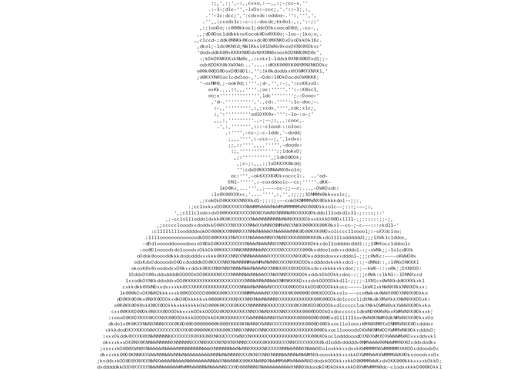

<!--
  github.com/lombazz — profile README
-->

<picture>
  <source media="(prefers-color-scheme: dark)" srcset="assets/ascii-dark.gif">
  
</picture>

<p align="center">
<a href="https://www.linkedin.com/in/alessandro-lombardo-/"></a>
<a href="https://x.com/lombazzzz"></a>
</p>

### `~ my stack`

<p>
<a href="https://www.hubspot.com"></a>
<a href="https://www.salesforce.com"></a>
<a href="https://n8n.io"></a>
<a href="https://www.clay.com"></a>
<a href="https://www.anthropic.com/claude-code"></a>
<a href="https://supabase.com"></a>
<a href="https://www.firecrawl.dev"></a>
</p>


### `~ mcp servers`

<p>
<a href="https://github.com/microsoft/playwright-mcp"></a>
<a href="https://github.com/exa-labs/exa-mcp-server"></a>
<a href="https://github.com/redis/mcp-redis"></a>
<a href="https://github.com/crystaldba/postgres-mcp"></a>
<a href="https://github.com/docker/mcp-servers"></a>
</p>


### `~ about me`

```
Name           ░░░░░░░░░░  Alessandro
Surname        ░░░░░░░░░░  Lombardo
Role           ░░░░░░░░░░  GTM Engineer
Currently      ░░░░░░░░░░  Building the GTM stack at Augment and scaled it from 100k to 2.5M monthly revenue
Random facts   ░░░░░░░░░░  21, Italian, Muay Thai fighter, VC Scout
```


### `~ by the numbers`

```
inbound leads managed / month   ░░░░░░░░░░  5k+
outbound leads managed / month  ░░░░░░░░░░  4k+
muay thai fights                ░░░░░░░░░░    4
hackathons attended             ░░░░░░░░░░   10
hackathons wins                 ░░░░░░░░░░    3
```


### `~ a day at work`

```mermaid
gantt
  title A day at work
  dateFormat HH:mm
  axisFormat %H:%M

  section Morning
    Lead data tracking      :09:00, 90m
    Data reporting          :10:30, 120m

  section Lunch
    Lunch break             :crit, 12:30, 60m

  section Afternoon
    Automation maintenance  :13:30, 120m
    Pipeline optimisation   :15:30, 150m
    CRM maintenance         :18:00, 120m
```




