<!--
  github.com/lombazz — profile README
-->

```
.lXMMMMMMMMMMMMMMMMMMMMMMMMMMMMMMMMMMMMMMMMMMMMMMMMMMMMMMMMMMMMMMMMMMMMMMMMMMMMMMMMMMMMMMMMM
.cXMMMMMMMMMMMMMMMMMMMMMMMMMMMMMMMMMMMMMMMMMMMMMMMMMMMMMMMMMMMMMMMMMMMMMMMMMMMMMMMMMMMMMMMMM
.cKMMMMMMMMMMMMMMMMMMMMMMMMMMMMMMMMMMMMMMMMMMMWWMMMMMMMMMMMMMMMMMMMMMMMMMMMMMMMMMMMMMMMMMMMM
.cKMMMMMMMMMMMMMMMMMMMMMMMMMMMMMMMMMMMMMWXKK0K0KNMMMMMMMMMMMMMMMMMMMMMMMMMMMMMMMMMMMMMMMMMMM
.cKWMMMMMMMMMMMMMMMMMMMMMMMMMWWMMMMMMXOdooolll:coO00O0KXWMMMMMMMMMMMMMMMMMMMMMMMMMMMMMMMMMMM
.cKWMMMMMMMMMMMMMMMMMMMMWNNx;''dK00Oo'';oc;;;;:,'';:oxxo:lkXNWWWMMMMMMMMMMMMMMMMMMMMMMMMMMMM
.cKWMMMMMMMMMMMMMMMMMMNK:'.....cOoc;.'c;,,'. ..   ..':lcc;;okOkOKNWMMMMMMMMMMMMMMMMMMMMMMMMM
.cKWMMMMMMMMMMMMMM0ldOkl;'';ooc;::'......';:',......;x:..''..,:lx0KXWMMMMMMMMMMMMMMMMMMMMMMM
.cXMMMMMMMMMMMMMMMo.,:olco;'ldl;.:l,;'  .  .,:...,;,;:,'','...  ;ckxkWMMMMMMMMMMMMMMMMMMMMMM
.cXMMMMMMMMMMMMMMNc.'.,;'....,;:col;...    ..'....,cxkdldol;',, .,;:;OMMMMMMMMMMMMMMMMMMMMMM
.;kNWMMMMMMMMMMNkc:'.. ..  ....:oooc'       ';..    .';clxkkd;.'::clc:k0NWMMMMMMMMMMMMMMMMMM
'.,:lxkO000000K0doc,'..,'. .. .,,,;,,;.....  .cc        ,c;:cod:cdddd::okOO0O0O0000000000000
,''.,xKNWWWWNKOdc:,,,'..  ..    ........,;,...'.  ..      .  .',ldc;'..,cOKXNWWWWWWWWWWWWWWW
,,'.oNMMMMMNk:l'...    .'';.         .. ..  ..          .      .',.   .;:xOXMMMMMMMMMMMMMMMM
,,''oNMMMMKOk:'       ...            .,'..             .;:'.   ...    ...xXWMMMMMMMMMMMMMMMM
,,''oNMMMNoKd..      ..          ..        .                 ..       .. .kWMMMMMMMMMMMMMMMM
,,''oNMMM0oK...........                   ...                             lKMMMMMMMMMMMMMMMM
,,,'oNMMMXxO.   ..''..          ..                                       .oNMMMMMMMMMMMMMMMM
;,,'oNMMMWN0..                         ..                               .dlxWMMMMMMMMMMMMMMM
;,,'oNMMMMWX;K:                     .':oc.                              .co,KWONMMMMMMMMMMMM
;;,'oNMMMMMN:'.                    .lxxxxxdoc:,'..                          '''KMMMMMMMMMMMM
;;,'oNMMMMXd'                     .,cdxxxxdol:.                              .'OMMMMMMMMMMMM
;;,'oNMMMMo                          ':lodoc,.     .'..                    :kOXMMMMMMMMMMMMM
;;,'lXMMMM0c;.        ....'.''''. ....,lk0ko.    .:'.                    .0WMMMMMMMMMMMMMMMM
;;,'lXMMMMMN0x'..     :c:;,....   ,,:oddk0Od' .':clc;,'...';;,...        .WMMMMMMMMMMMMMMMMM
;;,'lNMMMMMMMMXXNl   .dxdolc:::;:ccldxxkO0ko,..';lodoooooddol:,.'.    .. 'WMMMMMMMMMMMMMMMMM
:;,'lXMMMMMMMMMN:.....xOOOOkkxxxxxkOOkkOOOkd;...;coxkkkkkkxdl;'',.    ..,cMMMMMMMMMMMMMMMMMM
:;,'cKWMMMMMMMMWK::lx.lO000000000000OOOO0OOkl'...:dxkkkxxxdoc,..,.  ....,dMMMMMMMMMMMMMMMMMM
:;;''dKWMMMMWNNXXX00k;,kO000000000000OO000K0kl'..'lxkkkkxdol;...'.  ..',;dMMMMMMMWWWWWWWWWWW
:;,'cKWMMMMMMWWWWWN0dcdkkkOO00000000OkO0OOOxo,....'oxkkxdol;'...'.  ..';cNMMMMMMMMMMMMMMMMMM
:;,,oNMMMMMMMMMMMMWOodOkxkkOOOOOO00OOkd:'',..     .,odxdoc:'....,. ...,oNMMMMMMMMMMMMMMMMMMM
:::;oXMMMMMMMMMMMMM0xxkxddkkOOOO000OOOd;,;,.     ..,codol:'.. ..;;;oxkXMMMMMMMMMMMMMMMMMMMMM
::::l0NMMMMMMMMMMMMWKOOkxxxkkOOO0OO0OOOkkkdccc:;,,,;;:c::;..  ..,xNMMMMMMMMMMMMMMMMMMMMMMMMM
::::lONWMMMMMMMMMMMMMNK0XKxxkkkOOOOkkkOOkxdddl;''.....,;;;...  ..kMMMMMMMMMMMMMMMMMMMMMMWWMW
::::l0NMMMMMMMMMMMMMMMMMMWOdxxkkkkxdlc:;;:::;,,,'.  ..:cc;.     .OMMMMMMMMMMMMMMMMMMMMMWWWWW
::::lONMMMMMMMMMMMMMMMMMWW0dddddxxdollollllc::,'....':ll;.      .KMMMMMMMMMMMMWWMMMMMWNNNNNX
::::ckKNWWMMMMMMMMMWWNNNNNXdoodddddxxxxdlc;,',;ccccccllc,.      .KNWWWNNNNXXXXXXXNNNXXKKK000
::::cxKNWWWWWWMMMMMWWNXKXXXOoodddddxxkkkxxkxxxxkxxxdolc,.       .0XXXXXKK00KKKKKKKKKKKKKKK0K
::::cxKNWWWWWMMMMMMMWXKKKKKX0doddddxkkOO00OOOOkkxxdol:;..       .KNNNXXXXKKKKXKXXXXXXXXXXXXX
:::::dOXNWWWWWWMMMMWNXKKKKKKXN0dodxxkkkOOOOOOkkxddl:,'.         .0NNNNXXXXXXXXXXXXXXXXXXXXXX
:::::dOXNNWNNNNNWWWNXXKKKKKXNWMXlclloddddddddool:,..            .ONNNNNNNNNNNXXXNNNXXXXXXNNX
:::::d0XNWWWNXXXXXXXKKKKKXXNWMMWko;'',,;;,,,,'..                 OWWWWWWWWNNXXXXNNXXXXXXXNNX
::::;okKXNNXXKKKKKKKK000KKXXNNNNOxdl,..                          kNNNNNNNNXX00KXXXXKKKKKKKKK
:::;,:ok00000000000000OOOOOxc::oxxxdol:,.                       .o0KXK000Kx...:O0000OOOOOOOO
:::;,,:oxkkxxxxxkkkxxxxxxxx,  .c:ddddolc;'.                      ;dkOxdddKXc   cxxxddooooooo
```

```diff
- Name: ................... Alessandro
- Surname: ................ Lombardo
- Role: ................... GTM Engineer
- Currently: .............. Building the GTM stack at Augment and scaled it from 100k to 2.5M monthly revenue
- Random facts: ........... 21, Italian, Muay Thai fighter, VC Scout
```

[](https://www.linkedin.com/in/alessandro-lombardo-/)
[](https://x.com/lombazzzz)


### `~ by the numbers`

```diff
- inbound leads managed / month   ░░░░░░░░░░  5k+
- outbound leads managed / month  ░░░░░░░░░░  4k+
- muay thai fights                ░░░░░░░░░░    4
- hackathons attended             ░░░░░░░░░░   10
- hackathons wins                 ░░░░░░░░░░    3
```


### `~ a day at work`

```mermaid
gantt
  title A day at work
  dateFormat HH:mm
  axisFormat %H:%M

  section Morning
    Lead data tracking      :09:00, 90m
    Data reporting          :10:30, 120m

  section Lunch
    Lunch break             :crit, 12:30, 60m

  section Afternoon
    Automation maintenance  :13:30, 120m
    Pipeline optimisation   :15:30, 150m
    CRM maintenance         :18:00, 120m
```




### `~ stack`

[](https://www.hubspot.com)
[](https://n8n.io)
[](https://www.clay.com)
[](https://playwright.dev)
[](https://www.anthropic.com/claude-code)
[](https://supabase.com)
[](https://modelcontextprotocol.io)
[](https://www.firecrawl.dev)
